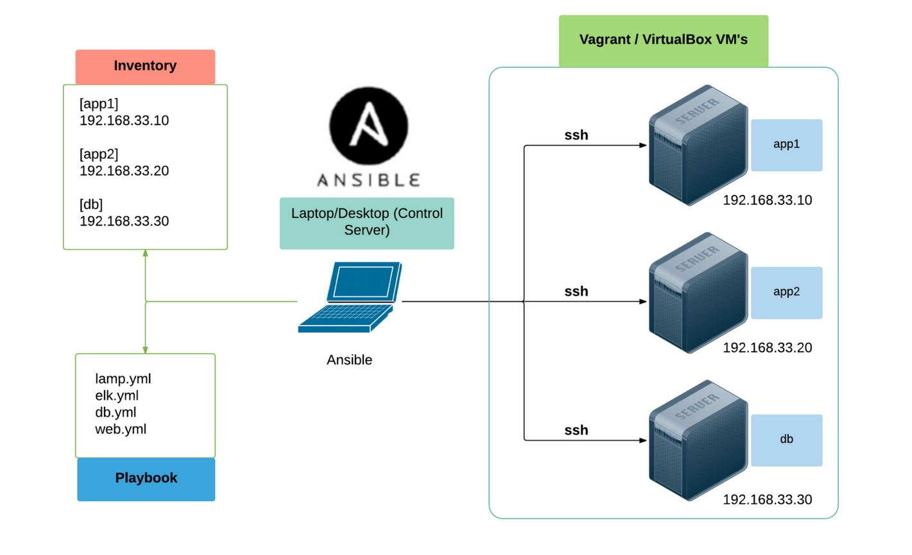

# Notions et definitions Ansible

## Introduction

Ansible est un gestionnaire de configuration et un outil de déploiement et d’orchestration très populaire et central dans le monde de l'infrastructure as code (IaC).

Il fait donc également partie de façon centrale du mouvement DevOps car il s’apparente à un véritable couteau suisse de l’automatisation des infrastructures.


## Histoire

 Créé en 2012 (2015 repris par Redhat) par Michael DeHaan (Cobler, outil de provisionnement)

## Architecture



Simplicité :

- *ssh* : Connexion classique
- *python* : multiplateforme donc adapté à tous

## L'inventaire

La liste de machines sur lesquelles vons s'exécuter les modules Ansible.

- Classées par groupe et sous groupes
- La méthode de connexion pour chaque machine.
- Variables à définie pour chaque groupe/machine pour contrôler dynamiquement la configuration ansible.

```yaml
[all:vars]
ansible_ssh_user=elie
ansible_python_interpreter=/usr/bin/python3

[awx_nodes]
awxnode1 node_state=started ansible_host=10.164.210.101 container_image=centos_ansible_20190901

[dbservers]
pgnode1 node_state=started ansible_host=10.164.210.111 container_image=centos_ansible_20190901
pgnode2 node_state=started ansible_host=10.164.210.112 container_image=centos_ansible_20190901

[appservers]
appnode1 node_state=started ansible_host=10.164.210.121 container_image=centos_ansible_20190901
appnode2 node_state=started ansible_host=10.164.210.122 container_image=centos_ansible_20190901
```

## Configuration

Configuration dans le dossier : `/etc/ansible`.

On peu aussi configurer ansible par projet avec un fichier `ansible.cfg`.
 
 ## Commande Ansible

Minimale

 - `ansible <groupe_machine> -m <module> -a <arguments_module>`

Tests hôtes joinables

- `ansible all -m ping`

Version complète

- `ansible <groupe_machine> --inventory <fichier_inventaire> --become -m <module> -a <arguments_module>`

## Installation en python (pip3)


- `apt install python3-pip`
- `pip3 install ansible --upgrade`


## Control node :

-  noeud disposant de ansible et permettant de déployer
-  accès ssh aux autres machines
-  password ou clef ssh
-  sécurité importante

Managed modes :

- serveur cibles
- permet la connexion ssh
- élevation de privilèges via le user
  
Inventory :

- Inventaires des machines (ip, dns)
- format ini (plat) ou format yaml
- les variables (host vars et group vars)
- statique (fichiers) ou dynamique (api via script)
- utilisaation de patterns possible (srv-p)


## Playbooks
 
Document avec une série de tâches nommées et modulaires.


### Quelque informatique pratique :

-
- Ansible = Infrastructure as code + déploiement de configurations + installations
- à base de python
- Documentation : https://docs.ansible.com/
- orchestrateur basé sur du push > pas d’agent = serveur distant pousse les informations à la différence des outils à base d’agents > pull (puppet etc…)


### Source :

- [xavki](https://www.youtube.com/watch?v=tirjpYSMkkM&list=PLn6POgpklwWoCpLKOSw3mXCqbRocnhrh-&index=4)
- Cisco Devnet
- [Cours de Hardien Pelissier](https://cours.hadrienpelissier.fr/01-ansible/cours1/)
- [redhat](https://www.redhat.com/fr/topics/automation/learning-ansible-tutorial)
- [wikipedia](https://fr.wikipedia.org/wiki/Provisionnement)
