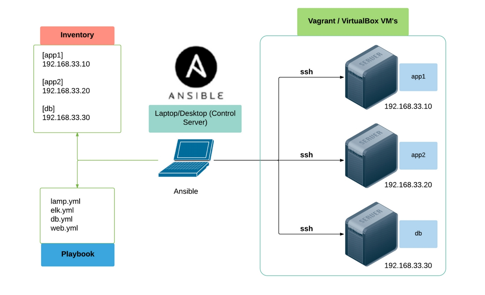

# Notions et definitions Ansible

## Introduction

Ansible est un **gestionnaire de configuration** et un outil de déploiement et d’orchestration très populaire et central dans le monde de **l'infrastructure as code** (IaC).

Il fait donc également partie de façon centrale du mouvement **DevOps** car il s’apparente à un véritable couteau suisse de **l’automatisation des infrastructures**.

### Ansible permet d'automatiser trois types de tâches :

- **Provisioning** : configurer les différents serveurs dont vous avez besoin dans votre infrastructure.
- **Configuration** : modifier la configuration d'une application, d'un système d'exploitation ou d'un périphérique, démarrer et arrêter les services, installer ou mettre à jour des applications, mettre en œuvre une politique de sécurité, ou effectuer une grande variété d'autres tâches de configuration.
- **Déploiement d'applications** : adopter une démarche DevOps en automatisant le déploiement d'applications développées en interne sur vos environnements de production.

## Objectifs de conception de Ansible

- **Le minimum par nature**. Les systèmes de gestion ne devraient pas imposer des dépendances supplémentaires sur l’environnement.
- **La cohérence**. cf. notion de test unitaire (procédure permettant de vérifier le bon fonctionnement d’une partie précise d’un logiciel ou d’une portion d’un programme).
- **La sécurité**. Ansible ne déploie pas des agents sur les noeuds. Un protocole de transport comme OpenSSH ou HTTPS est seulement nécessaire pour commencer une gestion.
- **La fiabilité**. Lorsqu’il est écrit soigneusement, un livre de jeu Ansible peut être idempotent afin d’éviter des effets secondaires inattendus sur les systèmes gérés.
- **Une courbe d’apprentissage faible**. Les livres de jeux Ansible utilisent un langage simple et descriptif basé sur YAML et les modèles Jinja2.

## Principe de fonctionnement

La grande force d’Ansible est qu’il facile à mettre en oeuvre car il est agent-less et ne nécessite qu’une connexion **SSH** et la présence de **python** pour lancer les taches à réaliser.

Lorsqu’il y a plusieurs machines à gérer, Ansible exécute les opérations en parallèle. Cela permet de gagner un temps considérable. Cependant, les tâches sont effectuées dans un **ordre définit** par l’utilisateur lors du choix de la stratégie: Par défaut Ansible **attendra d’avoir fini une tâche** (sur **tous les hôtes**) pour passer à la suivante.

Ansible et plus particulièrement ses modules sont **idempotents**. Cela signifie qu’une opération donnera le même résultat qu’on l’exécute une ou plusieurs fois. Par exemple, on va vérifier si un utilisateur existe : si c’est le cas, on ne fera rien mais si l’utilisateur n’existe pas alors on viendra le créer.

## [Architecture et principe d'Ansible](https://devopssec.fr/article/introduction-cours-complet-ansible#begin-article-section)

## Composants clés

- **Node Mannager**: ou *control node*, est le poste depuis lequel tout est executé via des connexions, essentiellement en SSH, aux nodes de l’inventaire. à sa connexion SSH.
- **Playbook**: Un **playbook Ansible** est une séquence de tâches ou de rôles décrits dans un fichier ou format yaml.
- **Inventory**: La liste des systèmes cibles gérés par Ansible est appelé un **inventaire**. On distingue deux type d’inventaire : l’inventaire statique constitué d’un fichier décrivant la hiérarchie des serveurs.
- **Module**:Les tâches et les rôles font appel à des modules mis à disposition avec Ansible. Je vous invite à consulter la [liste sur le site d’Ansible](https://docs.ansible.com/ansible/latest/collections/index_module.html).
- **Template**: Comme son nom l’indique, un template est un modèle permettant de générer un fichier cible. Ansible utilise Jinja2, un gestionnaire de modèles écrit pour Python. Les « Templates » Jinja2 permettent de gérer des boucles, des tests logiques, des listes ou des variable.
- **Rôle**: Afin d’éviter d’écrire encore et encore les mêmes playbooks, les roles Ansible apportent la possibilité de **regrouper des fonctionnalités** spécifiques dans ce qu’on appelle des **rôles**. Il seront ensuite intégrés aux playbooks Ansible.

## Configuration

Configuration dans le dossier : `/etc/ansible`.

On peut aussi configurer ansible par projet avec un fichier `ansible.cfg`.

### Source :
- [goffinet.org](https://linux.goffinet.org/ansible/presentation-produit-ansible/)
- [blog.stephane-robert](https://blog.stephane-robert.info/post/introduction-ansible/)
- [Xavki](https://www.youtube.com/watch?v=tirjpYSMkkM&list=PLn6POgpklwWoCpLKOSw3mXCqbRocnhrh-&index=4)
- Cisco Devnet
- [Cours de Hardien Pelissier](https://cours.hadrienpelissier.fr/01-ansible/cours1/)
- [redhat](https://www.redhat.com/fr/topics/automation/learning-ansible-tutorial)
- [wikipedia](https://fr.wikipedia.org/wiki/Provisionnement)
- [devopssec](https://devopssec.fr/article/introduction-cours-complet-ansible#begin-article-section)
- [openclassroom](https://openclassrooms.com/fr/courses/2035796-utilisez-ansible-pour-automatiser-vos-taches-de-configuration/6371335-installez-ansible-dans-votre-environnement)
