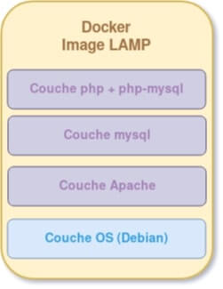

# Introduction

Cette documentation à pour but de créer vos propres images avec le Dockerfile, et pusher vos images vers le Hub Docker.

### Quequ'une images Docker ?

 Une image Docker est composé de plusieurs couches, ces couches contiennent l'application ainsi que les fichiers binaires et les bibliothèques requises.

 Exemple des couches pour créer une image d'un serveur web :

 - Une couche OS
 - Une couche Apache pour démarrer le serveur web.
 - Une couche php 
 - Une couche Mysql

Schéma de l'image :



## Les différentes instructions du Dockerfile

Inscructions Dockerfile les plus utiliser :

-  `FROM` : Définit l'image de base qui sera utilisée par les instructions suivantes.
- `LABEL` : Métadonnées de l'image ( auteur par exemple)
- `ARG` : Variable temporaires utilisables dans le Dockerfile.
- `ENV` : Variable d'environnements utilisables dans le Dockerfile et le conteneur.
- `RUN` : Exécute des commandes Linux ou Windows lors de la création de l'image.
- `COPY` : Permet de copier des fichiers depuis notre machine locale vers le conteneur Docker.
- `ADD` : Même chose que COPY mais prend en charge des liens ou des archives (si le format est reconnu, alors il sera décompressé à la volée).
- `ENTRYPOINT` : [Docs](https://aws.amazon.com/fr/blogs/france/demystifier-entrypoint-et-cmd-dans-docker/)
- `WORKDIR` : Définit le répertoire de travail qui sera utilisé pour le lancement des commandes CMD et/ou ENTRYPOINT et ça sera aussi le dossier courant lors du démarrage du conteneur.
- `WORKDIR` : Définit le répertoire de travail qui sera utilisé pour le lancement des commandes CMD et/ou ENTRYPOINT et ça sera aussi le dossier courant lors du démarrage du conteneur.
- `EXPOSE` : Expose un port.
- `VOLUMES` : Crée un point de montage qui permettra de persister les données.
- `USER` : Désigne quel est l'utilisateur qui lancera les prochaines instructions RUN, CMD ou ENTRYPOINT (par défaut c'est l'utilisateur root).

## Exemple de [Dockerfile](https://devopssec.fr/article/creer-ses-propres-images-docker-dockerfile) :


```yaml
# --------------- DÉBUT COUCHE OS -------------------
FROM debian:stable-slim
# --------------- FIN COUCHE OS ---------------------


# MÉTADONNÉES DE L'IMAGE
LABEL version="1.0" maintainer="AJDAINI Hatim <ajdaini.hatim@gmail.com>"


# VARIABLES TEMPORAIRES
ARG APT_FLAGS="-q -y"
ARG DOCUMENTROOT="/var/www/html"


# --------------- DÉBUT COUCHE APACHE ---------------
RUN apt-get update -y && \
    apt-get install ${APT_FLAGS} apache2
# --------------- FIN COUCHE APACHE -----------------


# --------------- DÉBUT COUCHE MYSQL ----------------
RUN apt-get install ${APT_FLAGS} mariadb-server

COPY db/articles.sql /
# --------------- FIN COUCHE MYSQL ------------------


# --------------- DÉBUT COUCHE PHP ------------------
RUN apt-get install ${APT_FLAGS} \
    php-mysql \
    php && \
    rm -f ${DOCUMENTROOT}/index.html && \
    apt-get autoclean -y

COPY app ${DOCUMENTROOT}
# --------------- FIN COUCHE PHP --------------------


# OUVERTURE DU PORT HTTP
EXPOSE 80


# RÉPERTOIRE DE TRAVAIL
WORKDIR  ${DOCUMENTROOT}


# DÉMARRAGE DES SERVICES LORS DE L'EXÉCUTION DE L'IMAGE
ENTRYPOINT service mysql start && mysql < /articles.sql && apache2ctl -D FOREGROUND
```

## `.dockerignore`

Il existe comme pour git un "ignore" afin de par exemple ne pas `ADD` / copier certains fichiers et/ou dossiers dans le conteneurs lors de l'exécution de l'instruction `ADD`.

Le fichier `.dockerignore` doit être à la racine ( avec le `dockerfile`)
## Build de l'image

```bash
docker build -t monDockerBuild .
```

`-t` : Nom de l'image
`.` : est le répertoire où se trouve le Dockerfile.

## Publier son image dans Docker Hub

Possible de les mettres en privé ou en publique.


1. Pour cela il faut vous connecter à votre compte :

```bash
docker login
```

2. Avoir un `dockerfile`
3. Build l'image
   
```bash
docker build -t onlymore/exemple
```
4. Push l'image

```bash
docker push onlymore/exemple
```


### Erreurs 

```bash
$docker login
error getting credentials - err: exit status 1, out:

$apt install gnupg2 pass
```
### Sources

- [Devopssec](https://devopssec.fr/article/creer-ses-propres-images-docker-dockerfile)
- [Wiki-tech.io](https://wiki-tech.io/Conteneurisation/Docker/Image)
- [Docs.docker.com](https://docs.docker.com/engine/reference/builder/)
- [OpenClassroom](https://openclassrooms.com/fr/courses/2035766-optimisez-votre-deploiement-en-creant-des-conteneurs-avec-docker/6211517-creez-votre-premier-dockerfile)

