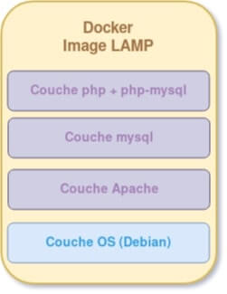

# Introduction

Cette documentation à pour but de créer vos propres images avec le Dockerfile, et pusher vos images vers le Hub Docker.

### Quequ'une images Docker ?

 Une image Docker est composé de plusieurs couches, ces couches contiennent l'application ainsi que les fichiers binaires et les bibliothèques requises.

 Exemple des couches pour créer une image d'un serveur web :

 - Une couche OS
 - Une couche Apache pour démarrer le seveur web.
 - Une couche php 
 - Une couche Mysql

Schéma de l'image :

## Les différentes instructions du Dockerfile

Inscructions Dockerfile les plus utiliser :

-  `FROM` : Définit l'image de base qui sera utilisée par les instructions suivantes.
- `LABEL` : Métadonnées de l'image ( auteur par exemple)
- `ARG` : Variablies tempodraires utilisables dans le Dockerfile.
- `ENV` : Variable d'environnements utilisables dans le Dockerfile et le conteneur.
- `RUN` : Exécute des commandes Linux ou Windows lors de la création de l'image.
- `ENTRYPOINT` : [Docs](https://aws.amazon.com/fr/blogs/france/demystifier-entrypoint-et-cmd-dans-docker/)

## Source 

- [Devopssec](https://devopssec.fr/article/creer-ses-propres-images-docker-dockerfile)
- [wiki-tech.io](https://wiki-tech.io/Conteneurisation/Docker/Image)
- [docs.docker.com](https://docs.docker.com/engine/reference/builder/)

EN cours