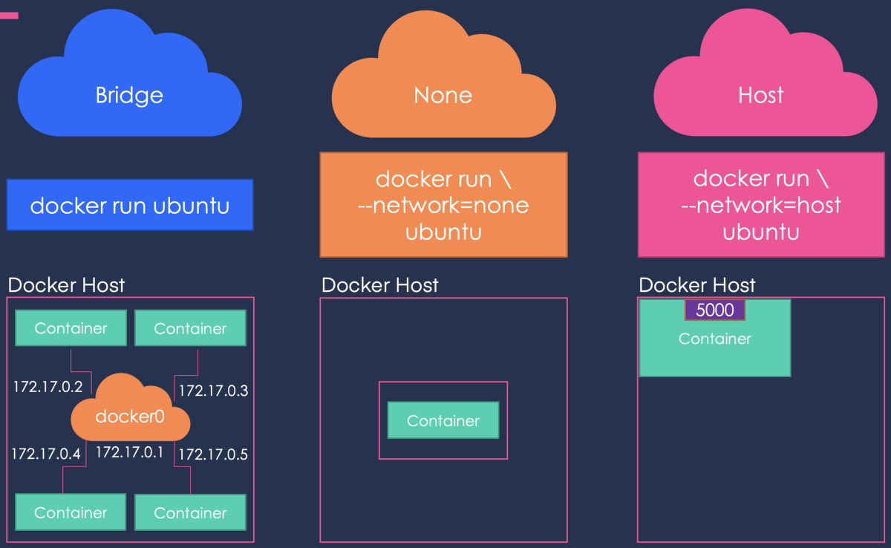
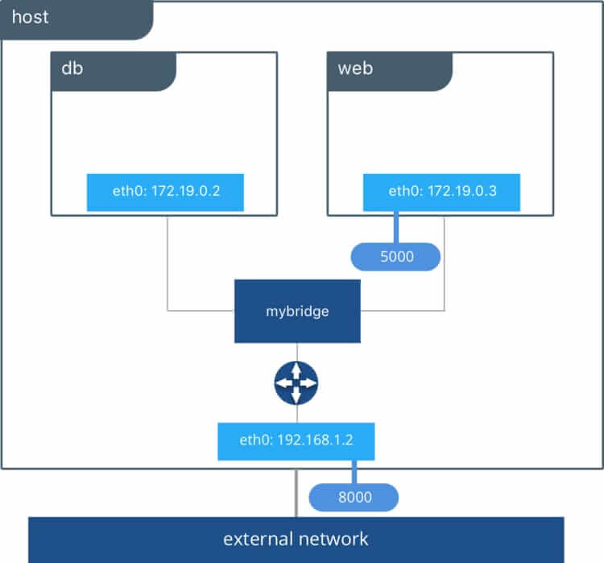

# Réseau dans docker

## Introduction

Pour que les conteneurs Docker puissent communiquer entre eux et aussi avec la machine hôte et les réseaux externes, une couche réseau doit être mise en place. 


## Les Différents type de réseau sur Docker


### Par défaut

Lors de l’installation de Docker, trois réseaux sont créés automatiquement. On peut voir ces réseaux avec la commande docker network ls. Un réseau de type bridge est créé :

```bash
#docker network ls
NETWORK ID          NAME                DRIVER              SCOPE
32cd2d55155f        bridge              bridge              local
b7fe5d1b69a7        host                host                local
de5ae709fdcd        none                null                local
```

Le réseau Bridge est présent sur tous les hôtes Docker. Lors de la création d’un conteneur, si l’on ne spécifie pas un réseau particulier, le conteneur est connecté au Bridge **docker0**.

Lorsqu'un conteneurs utilisant le bridge est lancé, il est possible de voir avec `ip addr` l'interface : "docker0"

### Bridge

Le réseau bridge est le plus couramment utilisé. Les conteneurs qui utilisent ce driver, ne peuvent communiquer qu’entre eux, cependant ils ne sont pas accessibles depuis l’extérieur si un mappage de port n'est pas mise en place.

Exemple de mappage de port avec run : `docker run -it -p 8000:5000 alpine` (`-p 8000:5000` permet de rediriger les paquets de l'hôte sur le port 8000 vers le port 5000 du conteneurs)

#### Schéma 


#### Approfondir sur le bridge dans docker
- https://blog.alphorm.com/reseau-docker-partie-1-bridge/


## Analyse du réseau

Pour en savoir plus sur un driver : `network inspect bridge`

#### Source :

- [wiki-tech.io](https://wiki-tech.io/Conteneurisation/Docker/R%C3%A9seau)
- [alphorm](https://blog.alphorm.com/reseau-docker-partie-1-bridge/)


