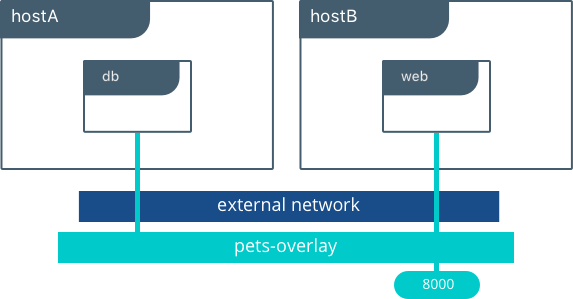

# Réseau dans docker

## Introduction

Pour que les conteneurs Docker puissent communiquer entre eux et aussi avec la machine hôte et les réseaux externes, une couche réseau doit être mise en place.


## Les Différents type de réseau sur Docker


### Par défaut

Lors de l’installation de Docker, trois réseaux sont créés automatiquement. On peut voir ces réseaux avec la commande docker network ls. Un réseau de type bridge est créé :

```bash
#docker network ls
NETWORK ID          NAME                DRIVER              SCOPE
32cd2d55155f        bridge              bridge              local
b7fe5d1b69a7        host                host                local
de5ae709fdcd        none                null                local
```

Le réseau Bridge est présent sur tous les hôtes Docker. Lors de la création d’un conteneur, si l’on ne spécifie pas un réseau particulier, le conteneur est connecté au Bridge **docker0**.

Lorsqu'un conteneurs utilisant le bridge est lancé, il est possible de voir avec `ip addr` l'interface : "docker0"

### Driver Bridge

Le réseau bridge est le plus couramment utilisé. Les conteneurs qui utilisent ce driver, ne peuvent communiquer qu’entre eux, cependant ils ne sont pas accessibles depuis l’extérieur si un mappage de port n'est pas mise en place.

Exemple de mappage de port avec run : `docker run -it -p 8000:5000 alpine` (`-p 8000:5000` permet de rediriger les paquets de l'hôte sur le port 8000 vers le port 5000 du conteneurs).

#### Schéma 


#### Approfondir sur le bridge dans docker : [ici](https://blog.alphorm.com/reseau-docker-partie-1-bridge/)

### Driver none

C’est le type de réseau idéal, si vous souhaitez interdire toute communication interne et externe avec votre conteneur, car votre conteneur sera dépourvu de toute interface réseau (sauf l’interface loopback).

### Driver host

Ce type de réseau permet aux conteneurs d’utiliser la même interface que l’hôte. Il supprime l’isolation réseau entre les conteneurs et seront par défaut accessibles de l’extérieur. Il prendra donc la IP que votre machine hôte.


### Driver overlay

Si vous souhaitez une mise en réseau multi-hôte native, vous devez utiliser un driver overlay. Il crée un réseau distribué entre plusieurs hôtes possédant le moteur Docker. Docker gère de manière transparente le routage de chaque paquet vers et depuis le bon hôte et le bon conteneur.




### Driver macvlan

Le driver macvlan permet d’attribuer une adresse MAC à un conteneur, le faisant apparaître comme un périphérique physique sur votre réseau. Le moteur Docker route le trafic vers les conteneurs en fonction de leurs adresses MAC.


## Manipulation du réseau dans Docker

Pour en savoir plus sur un driver : `network inspect bridge`

La commande pour créer un réseau Docker est la suivante :

```bash
docker network create --driver <DRIVER TYPE> <NETWORK NAME>
```

Dans cet exemple nous allons créer un réseau de type bridge nommé mon-bridge :

```bash
docker network create --driver bridge mon-bridge
```

On va ensuite lister les réseaux docker avec la commande suivante :

```bash
docker network ls
```

##### Résultat

```bash
NETWORK ID          NAME                     DRIVER              SCOPE
58b8305ce041        bridge                   bridge              local
91d7f01dad50        host                     host                local
ccdbdbf708db        mon-bridge               bridge              local
10ee25f56420        monimagedocker_default   bridge              local
6851e9b8e06e        none                     null                local
```

Il est possible de récolter des informations sur le réseau docker, comme par exemple la config réseau, en tapant la commande suivante :

```bash
docker network inspect mon-bridge
```

#### Résultat :

```bash
[
    {
        "Name": "mon-bridge",
        "Id": "ccdbdbf708db7fa901b512c8256bc7f700a7914dfaf6e8182bb5183a95f8dd9b",
        ...
        "IPAM": {
            "Driver": "default",
            "Options": {},
            "Config": [
                {
                    "Subnet": "172.21.0.0/16",
                    "Gateway": "172.21.0.1"
                }
            ]
        },
        ...
        "Labels": {}
    }
]
```

Surcharger la valeur du Subnet et mettre une gateway :

```bash
docker network create -d bridge --subnet=172.16.86.0/24 --gateway=172.16.86.1 mon-bridge
```

### Un exemple

Connecter deux conteneurs à notre réseau bridge créé précédemment.

```bash
docker run -dit --name alpine1 --network mon-bridge alpine

docker run -dit --name alpine2 --network mon-bridge alpine
```

En inspectant le réseau `mon-bridge`, on peux voir les deux conteneurs et leurs informations :

```bash
docker network inspect mon-bridge
```

#### Résultat :

```bash
[
    {
        "Name": "mon-bridge",
        "Id": "ccdbdbf708db7fa901b512c8256bc7f700a7914dfaf6e8182bb5183a95f8dd9b",
        ...
        "Containers": {
            "1ab5f1815d98cd492c69a63662419e0eba891c0cadb2cbdd0fb939ab25f94b33": {
                "Name": "alpine1",
                "EndpointID": "5f04963f9ec084df659cfc680b9ec32c44237dc89e96184fe4f2310ba6af7570",
                "MacAddress": "02:42:ac:15:00:02",
                "IPv4Address": "172.21.0.2/16",
                "IPv6Address": ""
            },
            "a935d2e1ddf76fe49cdb1950653f4a093928020b49ebfea4130ff9d712ffb1d6": {
                "Name": "alpine2",
                "EndpointID": "3e009b56104a1bf9106bc622043a2ee06010b102279e24b4807c7b7ffec166dd",
                "MacAddress": "02:42:ac:15:00:03",
                "IPv4Address": "172.21.0.3/16",
                "IPv6Address": ""
            }
        },
        ...
    }
]
```

On ne peux pas créer de network host car on utilise l'interface de la machine hôte. Cela donne une erreur.

### Supprimer, déconnecter et connecter un réseau docker

Avant de supprimer votre réseau docker, il est nécessaire au préalable de supprimer tout conteneur connecté à votre réseau docker, ou sinon il suffit juste de déconnecter votre conteneur de votre réseau docker sans forcément le supprimer.

Nous allons choisir la méthode 2, en déconnectant tous les conteneurs utilisant le réseau docker `mon-bridge` :

```bash
docker network disconnect mon-bridge alpine1

docker network disconnect mon-bridge alpine2
```

Une fois que vous avez déconnecté tous vos conteneurs du réseau docker mon-bridge, vous pouvez alors le supprimer :

```bash
docker network rm mon-bridge
```

Cependant vos conteneurs se retrouvent maintenant sans interface réseau bridge, il faut donc reconnecter vos conteneurs au réseau bridge par défaut pour qu'ils puissent de nouveau communiquer entre eux :

```bash
docker network connect bridge alpine1

docker network connect bridge alpine2
```

Vérifiez ensuite si vos conteneurs ont bien reçu la bonne Ip :

```bash
docker inspect -f '{{.Name}} - {{range .NetworkSettings.Networks}}{{.IPAddress}}{{end}}' $(docker ps -aq)
```

#### Résultat

```bash
/alpine2 - 172.17.0.3
/alpine1 - 172.17.0.2
```

## Conclusion

Vous pouvez créer autant de réseaux bridge que vous souhaitez, ça reste un bon moyen pour sécuriser la communication entre vos conteneurs, car les conteneurs connectés au bridge1 ne peuvent pas communiquer avec les conteneurs du bridge2, limitant ainsi les communications inutiles.

Concernant le driver overlay, j’essayerais de vous montrer son utilisation dans un autre article car le sujet est très vaste et demande des connaissances sur d'autres sujets que nous n'avons pas eu encore l'occasion de voir, notamment le docker swarm.

## Aide mémoire 

```bash
## Créer un réseau docker
docker network create --driver <DRIVER TYPE> <NETWORK NAME>

# Lister les réseaux docker
docker network ls

## Supprimer un ou plusieurs réseau(x) docker
docker network rm <NETWORK NAME>

## Récolter des informations sur un réseau docker
docker network inspect <NETWORK NAME>
    -v ou --verbose : mode verbose pour un meilleur diagnostique

## Supprimer tous les réseaux docker non inutilisés
docker network prune
    -f ou --force : forcer la suppression

## Connecter un conteneur à un réseau docker
docker network connect <NETWORK NAME> <CONTAINER NAME>

## Déconnecter un conteneur à réseau docker
docker network disconnect <NETWORK NAME> <CONTAINER NAME>
    -f ou --force : forcer la déconnexion

## Démarrer un conteneur et le connecter à un réseau docker
docker run --network <NETWORK NAME> <IMAGE NAME>
```

### Sources

- [Wiki-tech.io](https://wiki-tech.io/Conteneurisation/Docker/R%C3%A9seau)
- [Alphorm](https://blog.alphorm.com/reseau-docker-partie-1-bridge/)
- [Devopssec](https://devopssec.fr/article/fonctionnement-manipulation-reseau-docker)


