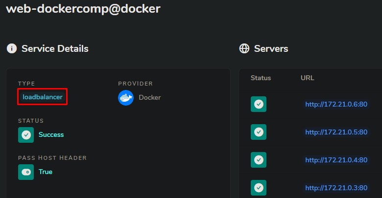

# Traefik

Traefik est un reverse proxy/répartiteur de charge, OpenSource et gratuit.

### Configuration de Traefik :

Configuration statique  

## Fonctionnement de traefik dans un cas simple : [lien doc](https://doc.traefik.io/traefik/getting-started/quick-start/)

Un conteneur **Traefik** écoute `/var/run/docker.sock`, afin de récupérer les événements docker.

```yaml title="traefikCompose.yml"
version: '3'

services:
  reverse-proxy:
    # image officiel docker
    image: traefik:v2.5
    # Activer l'interface web : "--api.insecure=true"; Traefik écoute docker "--providers.docker"
    command: --api.insecure=true --providers.docker
    ports:
      # Port HTTP
      - "80:80"
      # Interface web (activer par --api.insecure=true)
      - "8080:8080"
    volumes:
      # Pour que Traefik ecoute les evenement docker
      - /var/run/docker.sock:/var/run/docker.sock
```

Un conteneur pour faire fonctionner pour tester le reverse proxy (par exemple un simple serveur web) :

```yaml title="httpd.yml"
version: "3.9"
services:
  web:
    image: httpd
    labels:
      - "traefik.http.routers.whoami.rule=Host(`test.rocheralexandre.com`)"
```

### Test du load balancer

- `docker-compose scale web=4`




## [Traefik avec l'HTTPS/TLS](https://github.com/siavee/traefik-letsencrypt-compose)

L'exercice se compose en 3 fichiers :
- le docker-compose de **traefik**
- le docker-compose du **serveur web**
- les **variables** d'environnement 
- Fichier **configuration du tls**

=== "traefikHttps.yml"

    ```yaml 
    services:

      traefik:
        image: traefik:2.4.8
        command:
          - --log.level=DEBUG

          - --entrypoints.http.address=:80
          - --entrypoints.https.address=:443

          - --api=true
          - --providers.docker=true

          - --certificatesresolvers.letsencrypt.acme.httpchallenge=true
          - --certificatesresolvers.letsencrypt.acme.httpchallenge.entrypoint=http
          - --certificatesresolvers.letsencrypt.acme.email=${EMAIL}
          - --certificatesresolvers.letsencrypt.acme.storage=/letsencrypt/acme.json

          - --providers.file.filename=/etc/traefik/config/tls.yml


        labels:
          # Redirect all HTTP traffic to HTTPS
          - traefik.http.routers.to-https.rule=HostRegexp(`{host:.+}`)
          - traefik.http.routers.to-https.entrypoints=http
          - traefik.http.routers.to-https.middlewares=to-https

          - traefik.http.routers.traefik.entrypoints=https
          - traefik.http.routers.traefik.middlewares=auth
          - traefik.http.routers.traefik.rule=Host(`traefik.${DOMAIN}`)
          - traefik.http.routers.traefik.service=api@internal
          - traefik.http.routers.traefik.tls=true
          - traefik.http.routers.traefik.tls.certresolver=${CERT_RESOLVER}


          - traefik.http.middlewares.to-https.redirectscheme.scheme=https
          - traefik.http.middlewares.auth.basicauth.users=${TRAEFIK_USER}:${TRAEFIK_PASSWORD_HASH}     
        ports:
          - 80:80
          - 443:443
        volumes:
          - /var/run/docker.sock:/var/run/docker.sock:ro
          - /apps/traefik/letsencrypt:/letsencrypt # ACME (https)
          - /apps/traefik/config/:/etc/traefik/config/:ro # tls ( min tls 1.2)
        networks:
          - proxy

    networks:
      proxy:
        external: true
    ```

=== "httpdHttps.yml"

    ```yaml
    version: "3.9"
    services:
      web:
        image: httpd
        labels:
          - traefik.http.routers.https.rule=Host(`test.${DOMAIN}`) # A changer entre sous domaine !
          - traefik.http.routers.https.entrypoints=https
          - traefik.http.routers.https.tls=true
          - traefik.http.routers.https.tls.certresolver=${CERT_RESOLVER}
        networks:
          - proxy

    networks:
      proxy:
        external: true
    ```

=== ".env"

    ```conf
    EMAIL=mail@gmail.com
    DOMAIN=example.com
    CERT_RESOLVER=letsencrypt
    TRAEFIK_USER=admin
    TRAEFIK_PASSWORD_HASH=$2y$10$zi5n43jq9S63gBqSJwHTH.nCai2vB0SW/ABPGg2jSGmJBVRo0A.ni
    ```

=== "tls.yml"

    ```yaml
    # Dynamic configuration
    tls:
      options:
        default:
          minVersion: VersionTLS12
          sniStrict: true
    ```


Générer hash de mots de passe : [ici](https://www.web2generators.com/apache-tools/htpasswd-generator)

### Terme technique

| Terme | Définition |
| ----- |--- |
| Entrypoint | Point d'écoute de Traefik; redirection;... |
| Routers | couche(udp,tcp,http);host; |
| Middlewares | Juste avant le service finale (avant que les paquets quitte traefik)|


### Sources
- [doc.traefik](https://doc.traefik.io/traefik/)
- [mondedie.fr](https://mondedie.fr/d/11234-traefik-v2-un-vrai-reverse-proxy)
- [wiki-tech](https://wiki-tech.io/Conteneurisation/Docker/Traefik)
- [xavki](https://www.youtube.com/watch?v=6CFjKvPheCU)
- [devoxxFR](https://www.youtube.com/watch?v=QvAz9mVx5TI)
- [silarhi.fr](https://blog.silarhi.fr/docker-compose-traefik-https/)
- [A+ Avec Traefik](https://www.grottedubarbu.fr/traefik-2-rang-a-sur-ssllabs-et-securityheaders/)
