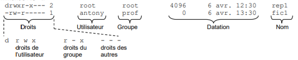

# Commande linux de base :

Commande de systeme :

- `reboot`	Redémarre
- `shutdown` -now	Éteint sans délais
- `systemctl` (start/stop/restart/status) <service>	Démarre/Arrête/Redémarre/Affiche le statut d’un service
- `hostname` Affiche le nom d’hôte de la machine
- `hostname` -I	Affiche l’adresse IP de l’hôte
- `date`	Afficher la date et l’heure du système
- `cal`	Affiche le calendrier du mois
- `whoami`	Affiche où nous sommes connecté en tant que qui
- `screenfetch`	Affiche les informations systèmes (nécessite le paquet screenfetch)


## Permission 

Voir les droits sur les fichiers du dossier : `ls -l`

### Schéma du fonctionnement des droits des fichiers.



Les droits peuvent être définit en octal : 4 pour read, 2 pour write, 1 pour execute : [ r w x] [ r - x] [ - - -] => 750

### Manipulation des droits

- `chmod [-R] <droits> <fichiers>` : Changement des droits
- `chown` : Change de propriétaire
- `chgrp` : Change le groupe du propriétaire.

## Gestion des paquets

- `apt-get update` : Mets à jour la liste des paquets depuis
/etc/apt/sources.list
- `apt-get upgrade` Mets à jour le système.
- `apt install <paquet>` Installe le paquet
- apt-get remove <paquet> Désinstalle le paquet. 
- `apt-get remove <paquet> -- purge` Désinstalle complètement le paquet.
- `apt-cache show <paquet>` Donne des Informations sur le paquet.
- `apt-cache search <paquet>` Recherche un paquet.
- `apt-cache depends <paquet> `Recherche les dépendances d’un paquet.
- `apt-get clean` Vide le cache disque des paquets


## Dossier de lancement de script au démarage

`/etc/init.d/`

## Manipulation de fichier

Connaitre la [taille des dossiers](https://www.it-connect.fr/connaitre-la-taille-dun-fichier-ou-dun-dossier-avec-du%EF%BB%BF/) et fichiers

- Connaitre la taille  d'un dossier et les dossiers dans le dossier

```bash
$ du -h
```

Connaitre la taille d'un dossier

```bash
$ du -sh /etc
```

## Les processus

- `ps` Affiche les processus en cours d’exécution. 
- `pstree` Affiche l’arborescence des processus. 
- `top` Affiche les processus en temps réel.
- `ctrl + c` Arrête un processus.
- `kill` Termine un processus. 
- `uname -a` Affiche le nom de la machine, le noyau,...
- `uptime` Affiche l'heure d'allumage, la charge, ...
- `w`	Affiche les utilisateurs actuellement connectés en SSH (date/heure/IP)
- `last reboot`	Afficher l’historique des redémarrages

## [Archivage et compression](https://lecrabeinfo.net/linux-compresser-decompresser-fichiers-dossiers-avec-tar-gzip-bzip2-xz.html)

Pour résumer :

- tar
  - permet de créer une archive ( combiner plusieurs fichiers en un seul)
- gzip
  - permet la compresion pour réduire la taille d'un fichier.
  
Commande tar :

```bash
tar -czvf nom-de-l-archive.tar.gz /chemin/vers/répertoire-ou-fichier
```

Options :

- `-c` : crée une archive.
- `-z` : compresse l'archive avec gzip
- `-v` : mode verbeux ( affiche la progession.)
- `-f` : permet de spécifier le nom de l'archive.

Plusieurs fichiers à la fois :

```bash
tar -czvf archive.tar.gz ~/Images/Wallpapers/ ~/Téléchargements/photo.jpg ~/Documents/sample.odt
```
### Décompresser une archive

Dans le répertoire courrant : 

```bash
tar -xzvf archive.tar.gz
```

Dans un répertoire spécifique :

```bash
tar -xzvf archive.tar.gz -C / tmp
```


