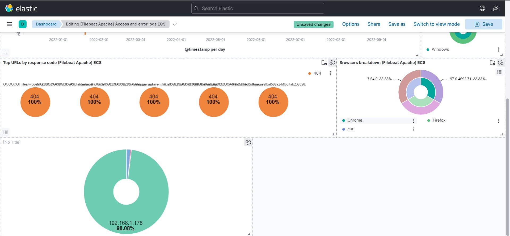

# Filebeat

Fichier de configuration : `filebeat.yml`

## Modules

Enlever le .enabled du nom du modules ou faire `filebeat modules enable apache`  / `filebeat modules list`

## Diagnostique

- `filebeat test config`
- `filebeat test output`

- `filebeat** setup` C'est quoi ?
    - Crée les index, etc.... N'envois pas **les fichier logs**

**Logstash** recueille les données à partir de sources et les envoies ensuite sur elasticsearch. (filebeat peut directement envoyer vers elasticsearch.)

Dashboard pour un serveur de test pour apprend la stack Elastic

### Sources

- [Video officiel d'Elasctic](https://www.youtube.com/watch?v=ykuw1piMGa4)
- [devopssec](https://devopssec.fr/article/comprendre-utiliser-filebeat-stack-elk#begin-article-section)
