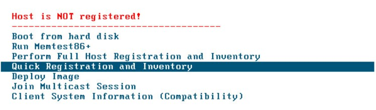

# Fog

Fog Project est un outil de capture et de déploiement d’image système qui prend en charge Windows, Linux et MacOS. Après avoir préparé votre premier système, clonez le puis déployez très rapidement.

## Installation 

```bash
git clone https://github.com/fogproject/fogproject.git
```

Une fois le Git cloné, lancez le script d’installation :

```bash
cd fogproject/bin
./installfog.sh
```

Suivre les instructions 

### Dans le DHCP
- `066 Nom d'hôte du serveur de démarrage` : ip serveur Fog 
- `067 Nom du fichier de démarrage` : `undionly.kpxe`

## Utilisation de fog 

Enregistrement de la machine :

1. Démarrer la machine depuis le réseau
2. Arriver sur l'interface Fog et faite `Quick Registration..` 
4. Il se retrouve dans `Host Management` 

### "Capture" de l'host

Transformer une machine en image :

1. Crée l'image et attribuer là à l'host
 Dans l'interface web : `Host Management` faire `Capture` 
2. Relancer la machine où vous avez lancé la `Capture` (lance la sur Fog via pxe)
3. La tâche est lancée

### "Deploy" une image

1. Enregistrer la machine sur fog
2. Attribuer lui l'image
3. Fait deploy
   

### Source
- [labo-tech](https://labo-tech.fr/base-de-connaissance/comment-installer-fog-sur-debian-9/)