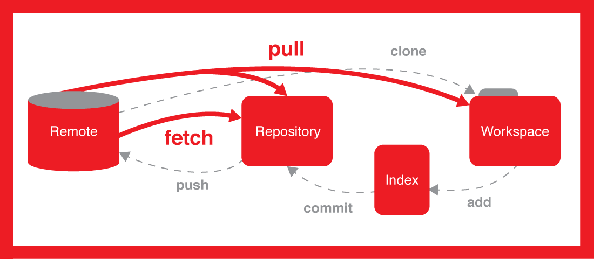

# GIT

Git est un logiciel de gestion de versions décentralisé. C'est un logiciel libre créé par Linus Torvalds, auteur du noyau Linux.


## Commandes

| Commandes | Description |
| ----------| ------------| 
|`git status` | Permets d’afficher le statut du dépôt dans lequel nous sommes (quelle branche, s’il y a des commit à réaliser…)|
|`git add nom_du_fichier`	| Permet de “tracker” (suivre) le fichier, et ainsi, le faire reconnaître par Git pour des prochaines actions (merge, commit, status…) |
| `git init “nom_du_dossier”`	| Initialise le dossier, créant ainsi un dossier caché “.git" qui sera reconnu par l’outil Git et les plateformes comme GitHub, GitLab… Sans cela, le dossier ne sera jamais utilisable par Git. |
|`git log`|Affiche les dernières actions réalisées sur le repository (incluant les métadatas, les commit ID, commit messages…)|
|`git clone`| Clone un projet sur sa machine.|
|`git commit` -am “message”| Met à jour le commit avec un message défini.|
|`git checkout`| Permet de changer de brancher ou de revenir à un commit précédent.|
|`git fetch`| Récupère les informations d’un repository sans télécharger sur la machine.|
|`git push`| Envoi la mise à jour au git distant (dit “remote”). Prends en compte le dossier dans lequel on se situe.|
|`git pull`| Récupère les dernières mises à jours du répertoire distant.|



## Github clone with sshkey 

### Generate ssh key

```bash
ssh-keygen -t ed25519 -C "your_email@example.com"
``` 

Ensuite la mettre la clé publique dans les clé ssh de github

## Bien nommer ses commits

- **feat** : nouvelle fonctionnalité
- **fix** : correction d’un bug
- **perf** : amélioration des performances
- **refactor** : modification du code qui n’apporte ni nouvelle fonctionnalité ni d’amélioration de performances
- **style** : modification du style du code (sans changer le code lui-même)
- **docs** : rédaction ou mise à jour de documentation
- **test** : ajout ou modification de tests

### Clone private repo on GitHub

```bash
git clone git@github.com:Theonlymore/OnlyDocs.git
``` 

#### Push le code

```bash
git add .
git commit -m "message"
git push
```

## Clone private repo on GitHub

Crée un token privé sur GitHub :

**Etape**


```bash
git clone https://github.com/theonlymore/private.git

Username : theonlymore
Password : tokens
```

## Sources : 

- [Wikipedia](https://fr.wikipedia.org/wiki/Git)
- [wiki-tech](https://wiki-tech.io/fr/Linux/D%C3%A9butant/Commandes)
- [OpenClassrooms](https://openclassrooms.com/fr/courses/5641721-utilisez-git-et-github-pour-vos-projets-de-developpement/)