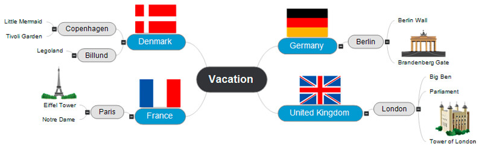

# Le Mind Mapping

Une carte mentale est une **représentation visuelle**  permettant d'**ordonner** de manière intuitive des idées, des tâches, des mots ou des concepts interconnectés autour d'un sujet central.

Cela permet de transformer une longue **liste** en **image graphique** vivante, attrayante et organisée à la manière dont le ** cerveau traite** les informations.

### Exemples

Ébauche d'idées de destinations touristiques, la carte mentale permet de parcourir la liste des lieux en quelques instants. 

## Les avantages du mind mapping

## La théorie dernière le mind mapping

Le mind mapping permet de tirer parti au mieux de facultés du cerveau humain, tout en utilisant un outil l'attire et le stimule.

La mémoire des images est particulièrement développée par le cerveau comme dit l'expression un image vaut mille mots, **les images sont plus susceptibles de déclencher de multiple association**s d'idées qui favorise les pensée **créative** et de **mémorisation**.

## Logiciel

Pour ma part, j'utilise le logiciel open-source [diagrams.net](https://www.diagrams.net/) pour créer mes cartes mental.

### Sources
- [mindmapping.com](https://www.mindmapping.com/fr/mind-map)