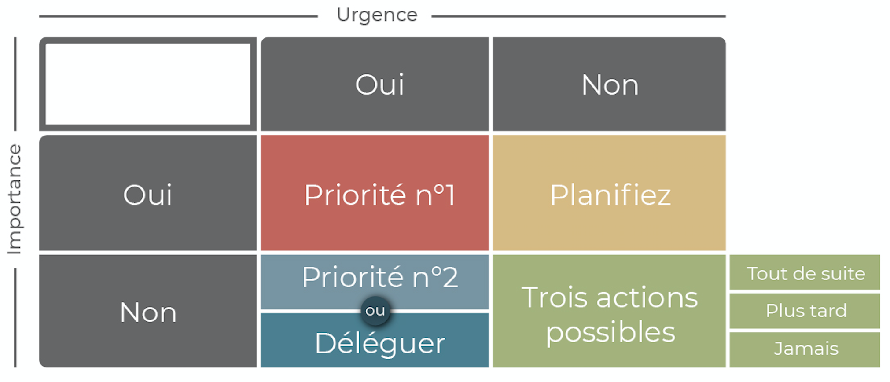

# Une to-do list efficace

La to-do list permet de **découpée les choses à faire par tâches**, cela fait partie des bonnes pratiques à adopter pour **accélérer ça productivité**.

## Les pièges des to-do list

1. **Précisez les tâches**

Ne pas être top généraliste :

- **X** : Faire les courses
- **V** : Racheter Pain, gourde...

2. Donnez vie au actions

Utiliser des verbes d'actions, en **indiquant directement l'objectif de la tâche**.

- **X** : Réparer le serveur backup
- **V** : serveur backup REMARCHE

Être **positif** dans l'action, cela donne bien plus **envie de la faire** pour ma pars cela me fait rire et me mes de bonne humeurs de voir ce genre de nom de tâche.

Inscrire une sous-tâche ou une check-list à l'intérieur de “serveur backup REMARCHE” pour indiquer ce dont vous avez besoin pour exécuter cette tâche principale.

> Etre précis sur les attentes/besoins

- serveur backup REMARCHE ( date limite : Vendredi 11 heures)
    - Disque dur ( 7200 tours minute, prix max 150 euros )
    - procédure reinstall services ( Voir pdf ci-jointe)

## Les priorité sur les actions

urgente : (est-ce que ça peut attendre 2 ou 3 jours ?)
importante : (est-ce que c’est grave si ce n’est pas fait ?) 

Schéma de qualification des tâches :

*La Matrice d'Eisenhower permet d'isoler les tâches urgents et importantes du reste. Un bon outil d'aide à la décision donc !*

## Le challenge

Le **challenge de temps pour un tâche permet de nous rendre plus productif et créatif** sur une tâche, plus nous avons de temps pour réaliser une tâche et plus la tâche va grandir et s'étaler dans le temps.

### Sources : 
- [openclassrooms Jonathan Fechner](https://openclassrooms.com/fr/courses/5944991-gerez-votre-temps-efficacement/6500291-creez-une-to-do-list-efficace)