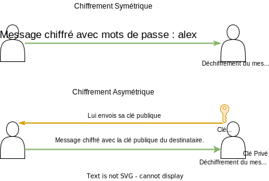

# Le chiffrement

Il existe principalement deux type de chiffrement `symétrique` et `asymétrique`.

Différence entre le chiffrement symétrique et asymétrique

Un système de chiffrement est dit : chiffrement **symétrique** quand il utilise la **même clé** pour chiffrer et déchiffrer. chiffrement **asymétrique** quand il utilise des clés différentes : une paire composée d'une **clé publique**, servant au chiffrement, et d'une **clé privée, servant à déchiffrer**.
