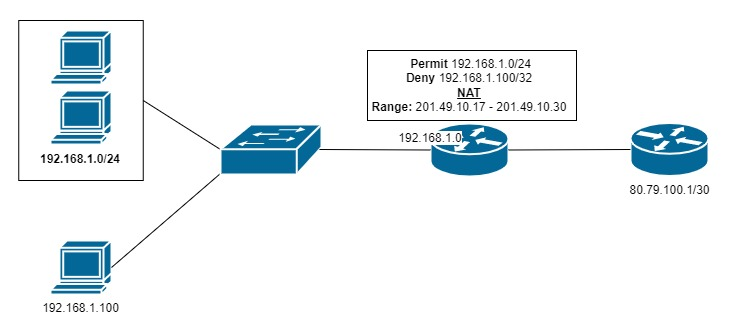

# NAT Cisco

Rappel du NAT en une image sinon : [docs](../nat-pat.md)


Un nat à deux partis

Mettre un nat sur une interface :

- Inside = Ip "privé"
- Outside = Ip "Publique"

```cisco
R1(config)#int fa0/0
R1(config-if)#ip nat inside
R1(config-if)#exit
R1(config-if)#exit
R1(config)#int fa0/1
R1(config-if)#ip nat outside
R1(config-if)#exit
```

### Un nat d'une range d'ip derrière une range d'ip (avec une ip statique enlever en moins) :


```ios
R1(config)#ip nat inside source static 192.168.1.100 201.49.10.30
```

**Vérification :**

```ios
Router#show ip nat translations 
Pro  Inside global     Inside local       Outside local      Outside global
---  201.49.10.30      192.168.1.100      ---                ---
```

**Pool de NAT**



| Description | Commandes | 
| --------- | ----------- |
| Crée un pool d'adresses NAT |`R1(config)#ip nat pool POOL-NAT-LAN2 201.49.10.17 201.49.10.30 netmask 255.255.255.240` |
| ACL deny (ne pas autoriser ip précise) | `config)#access-list 1 deny 192.168.1.100` |
| ACL permit (autoriser range d'ip)| `config)#access-list 1 permit 192.168.1.0 0.0.0.255` |
| Mettre le pool NAT avec ACL sur routeur | `R1(config)#ip nat inside source list 1 pool POOL-NAT-LAN2` <br> Ajouter `overload` à la fin si  il y plus de d'ip priver que publique |


## Plusieurs IP dernière la même ip :

| Description | Commandes | 
| --------- | ----------- |
| ACL permit range ip |  `R1(config)#access-list 2 permit 192.168.0.0 0.0.0.255`|
| **Activer le NAT** <br>- Sur interface serial 0/0 <br>- Pour l'acl 2 crée avant <br>- `overload` pour avoir plusieurs ip privé sur la même ip publique | `R1(config)#ip nat inside source list 2 interface serial 0/1/0 overload`|


