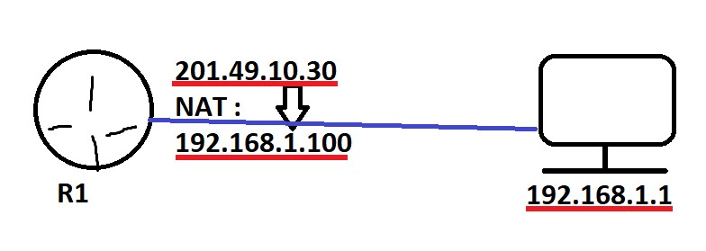

# NAT Cisco

Rappel du NAT en une image sinon : [docs](../nat-pat.md)


Un nat à deux partir

Mettre un nat sur une interface :

Inside = Ip "privé"
Outside = Ip "Publique"

```cisco
R1(config)#int fa0/0
R1(config-if)#ip nat inside
R1(config-if)#exit
R1(config-if)#exit
R1(config)#int fa0/1
R1(config-if)#ip nat outside
R1(config-if)#exit
```

Un nat d'une ip précise à un autre



```ios
R1(config)#ip nat inside source static 192.168.1.100 201.49.10.30
```

**Vérification :**

```ios
Router#show ip nat translations 
Pro  Inside global     Inside local       Outside local      Outside global
---  201.49.10.30      192.168.1.100      ---                ---
```