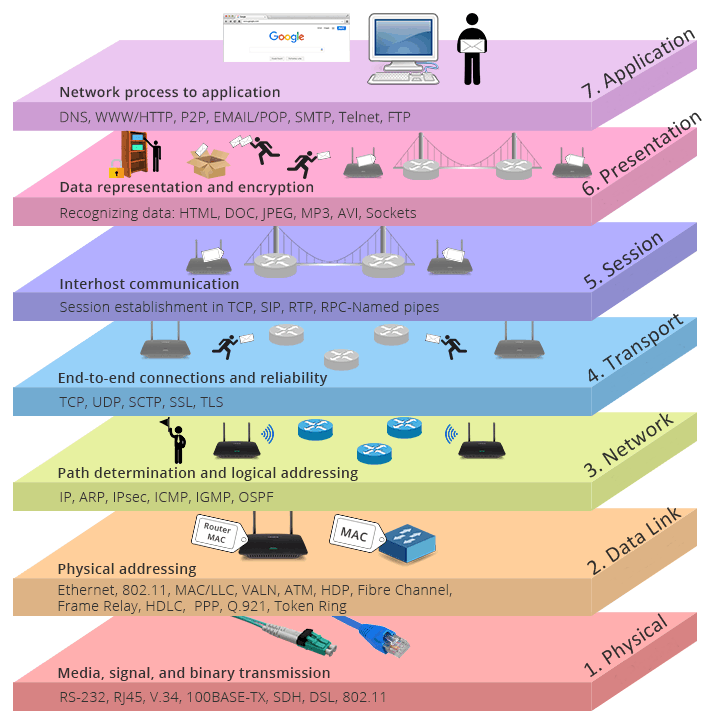

# Dépannage réseau

## Recherche et correction du problème
Les étapes de ce modèle sont les suivantes:

1. Collecte de toutes les données disponibles et analyse des causes d’échec.
2. Localisation du problème au sein d’un segment de réseau, d’une unité , ou au niveau utilisateur.
3. Liaison du problème à un matériel ou à un logiciel spécifique au sein de l’unité, du compte réseau d’un utilisateur.
4. Recherche et correction du problème.
5. Confirmation de la résolution du problème.
6. Rédaction d’une documentation sur le problème et sa solution.

  [Aller plus loin avec la doc de Rachid ezzine](7couches.md)

## Comment trouvé l'origine d'un problème

Utilisation des couches du modèle OSI afin de trouver la pannne, partir de la couche la plus faible pour atteindre la plus haute.

### Couche 1 : Physique

Problèmes possible :

- Câble débranché
- Interface shutdown
- Fibre Optique/Câble casser
- Signal atténué

### Couche 2 : Liaison de données

Problèmes possible :

- Découvert réseau / Arp non fonctionnel 
  - Probème avec broadcast
  - `ip neighbor show` pour connaître table ARP d'un linux.. 
  - Vlan
    - Sur un cisco : `show running config`
        - Mettre plusieurs interface vlan.

### Couche 3 : Réseau

Problèmes possible :

- Routage
- Mauvaise ip sur la machine
- ICMP : Par feux
- Sous-réseau
  
Penser au `traceroute`

### Couche 4 : Transport

Problèmes possible :

- Ports TCP ou UDP bloqués par les applications.

### Couche 5-7 :

Problèmes possible :

- ...

### Source :

- [Pratique en réseau : slideplayer](https://slideplayer.fr/slide/9114802/)
- [Conseils de depannage réseau : techtribune](https://fr.techtribune.net/linux/apprenez-les-conseils-de-depannage-reseau-de-base-partie-12/120778/)