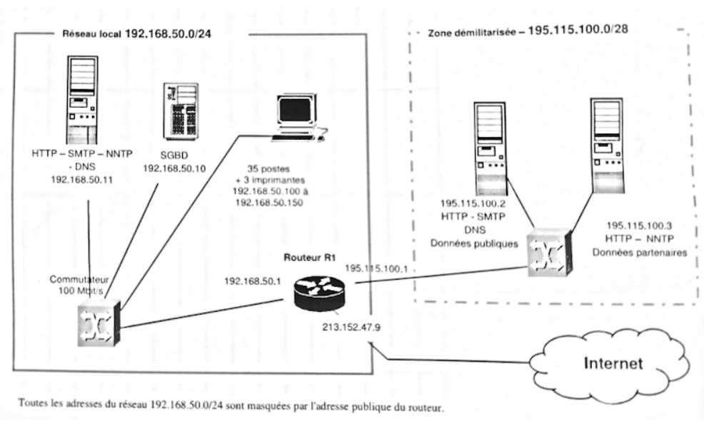

# Le filtrage 

Abréviation :
- `*` = Tout
- `A` = Accepte
- `B` = Bloquer

## Exemple de règles :

### Infrastructure :

### Règles :

- A : Toutes lses communications entre le poste 195.115.100.2 et toutes les autres postes sont autorisées.

| N' | Zone A | Action | Ip Source | Port source | Ip Destination | Port destination | Protocole | Etat TCP | Description |
|---------|---------|---------|---------|---------|---------|---------|---------|---------|---------|
| 1 | 192.115.100.1 | A | 195.115.100.2/32 | * | * | * | * | | A:Demande |
| 2 | 213.152.247.9 | A | * | 195.115.100.2/32 | * | * | * | | A:Retour |
