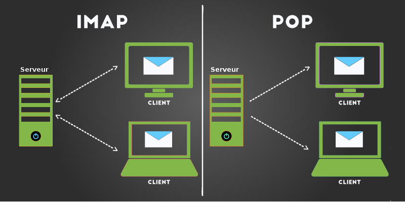

# Mail

## Pop3 (Post Office Protocol)

protocole qui permet de récupérer les courriers électroniques situés sur un serveur de messagerie électronique. 

Port 110 et 995(SSL)

## IMAP(Internet Message Access Protocol)

 protocole permettant l'accès direct à ses courriels sur un serveur de messagerie. ... On opère donc avec l'IMAP une relève du courrier, tout en conservant une copie de ce courrier sur un serveur.

## Diffenreces entre Pop et Imap

# SMTP (Simple Mail Transfer Protocol)

 Il récupère le mail rédigé dans un logiciel de messagerie type Outlook ou dans un webmail, et le transfert au destinataire en passant par une succession de serveurs

