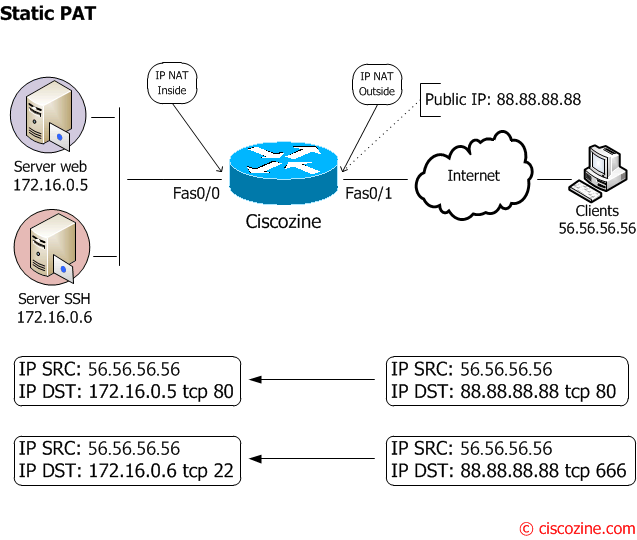

# NAT - Network address translation

La fonction du NAT est de traduire une adresse IP source interne en adresse IP globale. 
Ce procédé est très largement utilisé par les box internet des FAI pour cacher les ordinateurs personnels derrière une seule ip publique.

Cacher une ip dernière une autre ip.

# PAT - Port Address Translation

Similaire à NAT, il traduit également les adresses IP privées d’un réseau interne à l’adresse IP publique à l’aide de numéros de port.

Cacher le port d'une ip dernière une autre ip

### Sources
- [wikipedia et leurs sources](https://fr.wikipedia.org/wiki/Nat)
- [waytolearnx.com](https://waytolearnx.com/2018/07/difference-entre-nat-et-pat.html)

