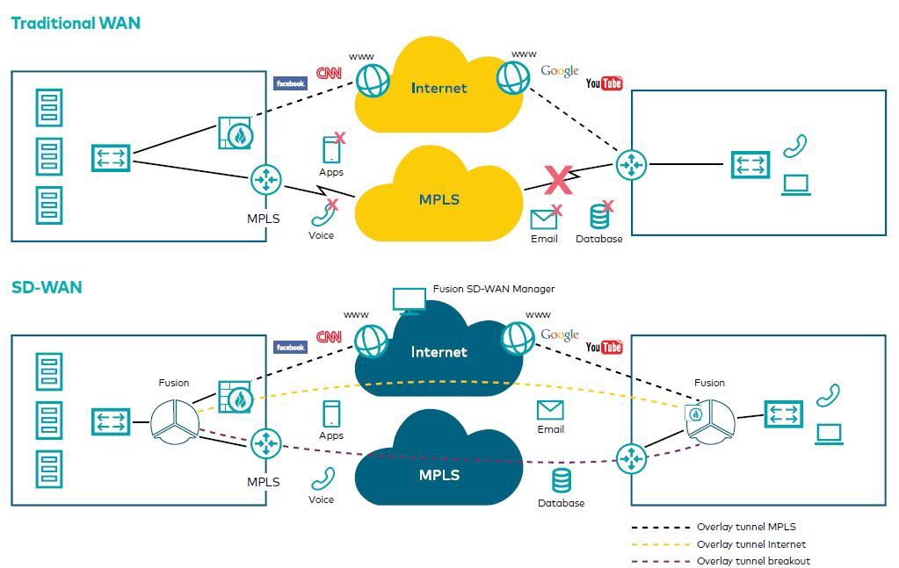

# SD-WAN - Software-Defined Wide Area Network

## Introduction 

| abréviation | Nom               | Description                                                          |
| ----------- | ----------------- | -------------------------------------------------------------------- |
| SD          | Software-Defined  | "Logiciel"                                                           |
| WAN         | Wide Area Network | Réseau **étendu** qui connecte les différents sites d'une entreprise |

SD-WAN signifit donc un Wan "logiciel".

### Sources 
- [Video KBTraining](https://www.youtube.com/watch?v=fy114RjX80U)
- [pyxya](https://www.pyxya.fr/le-wan-intelligent/wan-sd-wan-et-limites-actuelles/)
- [auranext](https://www.auranext.com/sd-wan-mpls-avantages-inconvenients/#:~:text=Le%20MPLS%20est%20un%20r%C3%A9seau,supervise%20et%20maintient%20l'ensemble.)
- [Cisco](https://www.cisco.com/c/fr_fr/solutions/enterprise-networks/sd-wan/what-is-sd-wan.html#~pourquoi-maintenant)