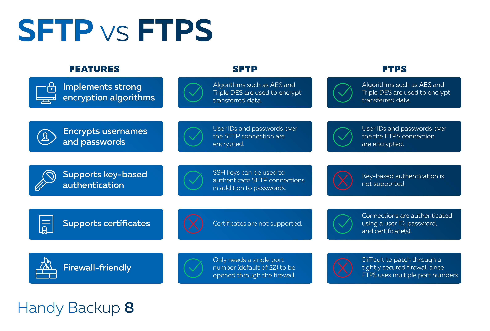

# FTP : Connexion non chiffré 

protocole de transfert de fichier ( **F**ile **T**ransfer **P**rotocol)

## SFTP vs FTPS : Connexion chiffré

SFTP (FTP via SSH) et FTPS (FTP via SSL)

Différences entre le sftp et le ftps :

### L'authentification
  
**SFTP** : user + mdp :
- Via mots de passe ssh
- Clé privé avec ou sans mdp

**FTPS** : user + mdp + certificat :

Les serveur **FTPS** commence par vérifier que **certificat** de confiance a été signé par un **autorité** de certification.

### Implémentation

SFTP : Simple
- Un seul port le 22 par défaut

FTPS : Difficile
- Plusieurs port

## Sources :
[goawywhere.com](https://www.goanywhere.com/fr/blog/sftp-ou-ftps-quel-est-le-meilleur)