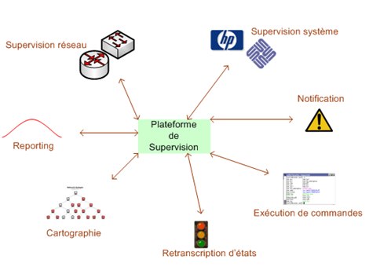

# Supervision

## Automatiser surveillance du système :

Rends cela propre à l'aide de schéma et autre...

## Objectif :

- `Surveillance` temps réel.
- `Rapporter` les éventuels incidents
- `Alerter` l'administration réseau
- `Avoir` des logs

Outils : 

- logiciels
- Matériels ( exemple stormshield)
  
## Fonctionnalités :

Equipements

- switchs, routeurs, serveurs,...

Services :

- DHCP, DNS, HTTP, ...

Pour les gros réseau, cela permet de cartographie le réseau :

