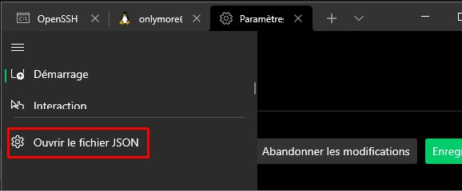

# Nouveau terminal Windows :

## Installation 

Via le [windows store](https://www.microsoft.com/fr-fr/p/windows-terminal/9n0dx20hk701#activetab=pivot:overviewtab)

## Raccourcis 

**fractionnement**

| Raccourcis                             | Description                   |
| -------------------------------------- | ----------------------------- |
| `alt+shift+6`                          | Fractionnement **horizontal** |
| `alt+shift+plus`                       | Fractionnement **vertical**   |
| `ctrl+shift+w`                         | Fermer le volet               |
| `alt+shift+droite, gauche,haut ou bas` | Redimensionner le volet       |
| `alt+droite, gauche, haut ou bas`      | Déplacer le focus             |


## Connexion SSH via le terminal 

Aller dans la configuration 




```json title="settings.json" hl_lines="10-16"
   "defaults": {},
        "list": 
        [
            {
                "commandline": "powershell.exe",
                "guid": "{61c54bbd-c2c6-5271-96e7-009a87ff44bf}",
                "hidden": false,
                "name": "Windows PowerShell"
            },
            {
                "colorScheme": "One Half Dark",
                "commandline": "ssh root@vps.fr -i C:/Users/Onlymore/repo/ssh/keyalex", # (1)!
                "hidden": false,
                "name": "VPS SSH"
            }
        ]
```
1.  :Changer le user, le serveur et l'emplacement de la clé ssh en fonction de vous.


