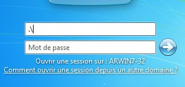

# Windows 

Windows est un système d'exploitation.

### Connection sur la machine et non le domaine : `.\`

### Dossier lancer au démarrage de Windows

1. `Windows+R`
2. `shell:startup`

### Executer pratique

| Ouvrir      | Description                   |
| ----------- | ----------------------------- |
| resmon      | Moniteur de ressources        |
| mmc         | Console admin mmc             |
| lusmrgr.msc | Console User et groupe locaux |

## CMD : rapidement

- `cmd /K ipconfig /all`
  

Autres : `cmd /?`